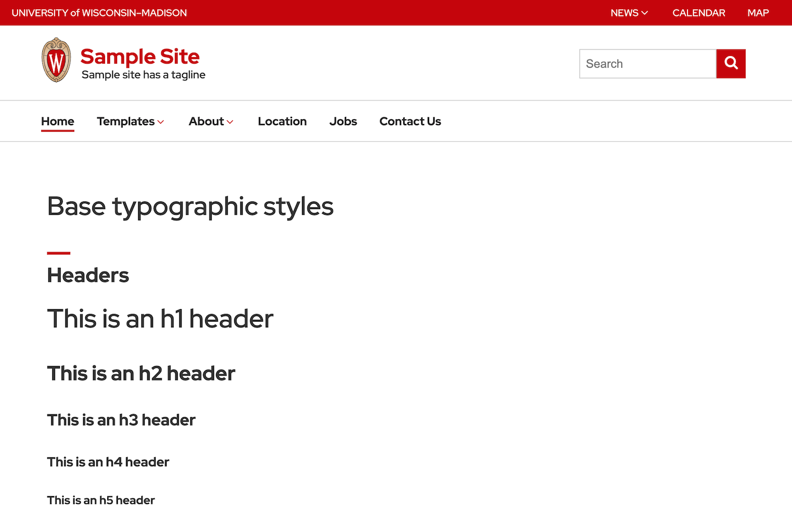

<p align="center">
  <div align="center">
    
  </div>
</p>

# UW Minimal Jekyll Template

This is a minimal Jekyll site that is based upon the standard UW web template.


<div align="center">UW Minimal Jekyll Template</div>
<br />

## Running

Simply run the following command to start the Jekyll app:

```
sh run.sh
```

The application will be visible at the following url:
```
http://127.0.0.1:4000/University-of-Wisconsin/
```

<!-- LICENSE -->
## License

Distributed under the MIT License. See `LICENSE` for more information.

<!-- CONTACT -->
## Contact

Abe Megahed - (mailto:amegahed@wisc.edu)